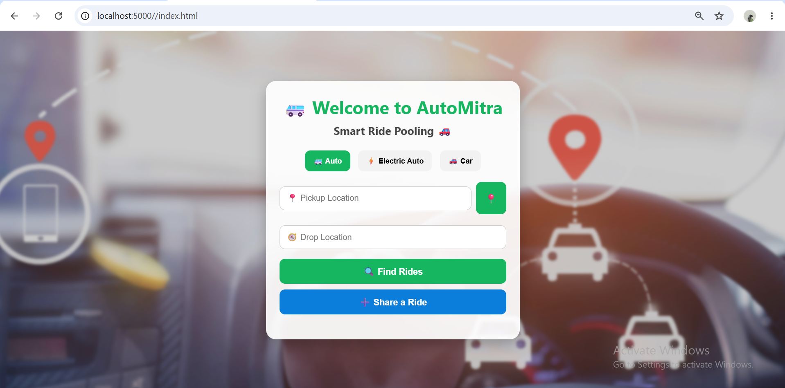
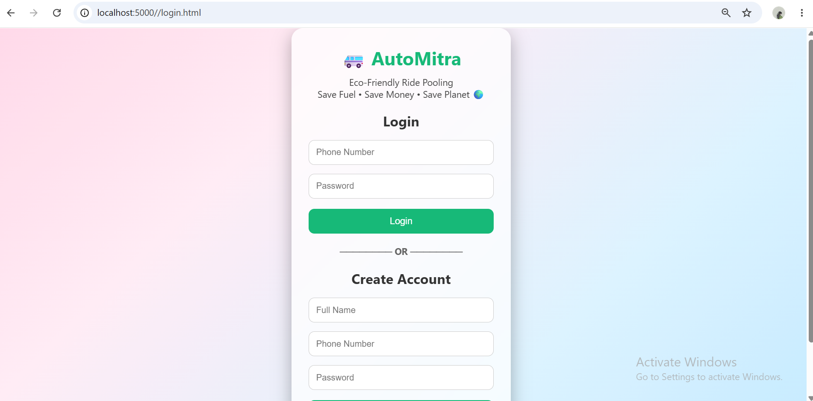
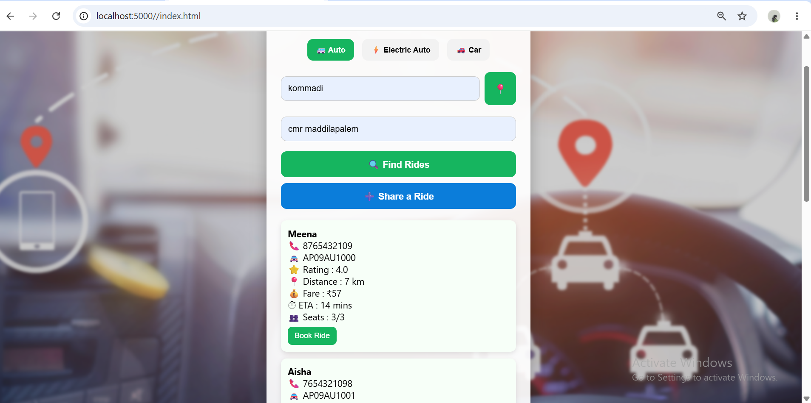
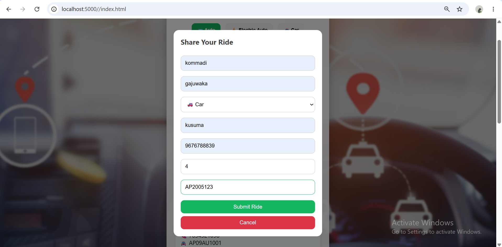
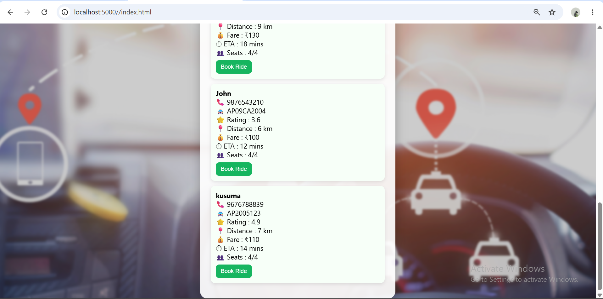
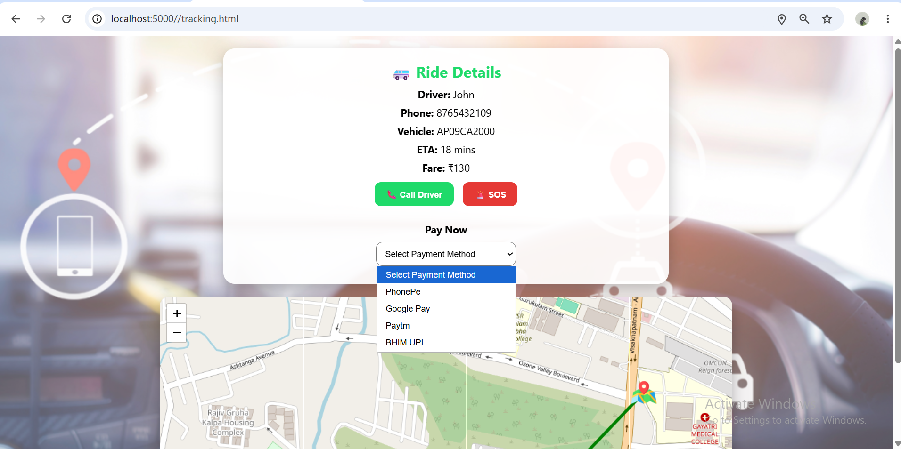
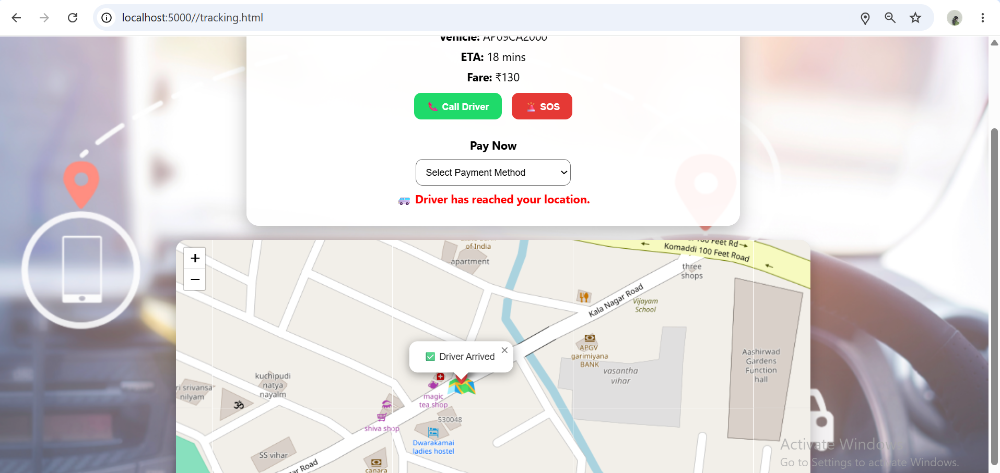
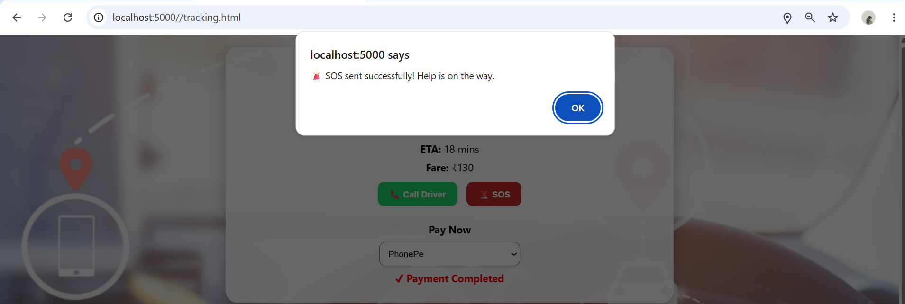

# AutoMitra 🚗
A smart ride-sharing platform that connects people travelling on the same route to reduce traffic, fuel consumption, and pollution.

# Introduction
AutoMitra is a smart ride-sharing platform designed to help people travelling on the same route share rides and reduce individual vehicle usage. The application connects riders who are travelling in a similar direction, allowing them to share available rides and make daily transportation more affordable and sustainable.

## Problem Statement

In cities, many people travel alone to offices, colleges, and other places during peak hours. This increases traffic congestion, fuel consumption, and air pollution. AutoMitra provides a solution by encouraging people travelling on similar routes to share rides.

## Solution

AutoMitra allows users to update their travel details and find available rides from people travelling on the same route. Users can book shared rides using different vehicle options based on their requirements.

## Features

*  **Find Rides**

   Search and find rides available on similar routes.

*  **Ride Sharing**

  Connects people travelling in the same direction for shared transportation.

*  **Multiple Vehicle Options**

  * Supports:

     Car
     Auto
     Electric Auto

*  **Women Safety Feature**

   Includes an SOS emergency feature to improve passenger safety.

* **Eco-Friendly Transportation**

   Encourages ride sharing and electric vehicle usage to reduce fuel consumption and pollution.

## Benefits

 Reduces traffic congestion during peak hours.
 Saves fuel by reducing the number of individual vehicles.
 Helps decrease carbon emissions and pollution.
 Provides affordable transportation options.
 Improves safety through emergency support features.

## Technologies Used

 Frontend: HTML, CSS, JavaScript
 Backend: Node.js, Express.js
 Database: MongoDB

## Future Enhancements

 Live GPS tracking
 Online payment integration
 AI-based route matching
 Rating and review system
 Real-time ride notifications

## Project Architecture

AutoMitra follows a client-server architecture.

### User Flow

1. User opens the AutoMitra application.
2. User can create an account or login.
3. User enters ride details such as:
   - Starting location
   - Destination
   - Travel time
   - Vehicle type
4. The system searches for users travelling on similar routes.
5. Users can select and book available rides.
6. Fare is calculated and shared among ride members.
7. Users can complete payment through UPI-based payment options.

### System Components

- **Frontend**
  - Provides user interface for signup, login, finding rides, and booking rides.

- **Backend (Node.js + Express.js)**
  - Handles user requests, ride details, booking operations, and data processing.

- **Data Storage (JSON Files)**
  - Stores user information and ride-related data.

## Screenshots

### Home Page

### Login Page

### Find Rides

### Ride Sharing

### Shared Ride Details

### Book Ride

### Driver Arrived

### SOS Safety Feature

